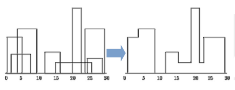

# Tema 1: La eficiencia de los algoritmos
## Índice
1. [El concepto de algoritmo](#introduction)
2. [Calculo de la eficiencia de un algoritmo](#paragraph1)
    1. [Principio de invarianza](#subparagraph1)
    2. [Notacion O](#subparagraph2)
        1. [Equivalencia entre ordenes de eficiencia](subsubparagraph1)
    3. [Notacion Ω](#subparagraph3)
    3. [Notacion Θ](#subparagraph3)
    3. [Propiedades de las ordenes de eficiencia](#subparagraph5)
3. [Análisis de algoritmos](#paragraph2)
3. [Eficiencia de una funcion](#paragraph3)
3. [Resolucion de recurrencias](#paragraph4)

## 1. El concepto de algoritmo [](#){name=paragraph1}
Secuencia finita ordenada de pasos exentos de ambigüedad tal que, al llevarse a cabo con fidelidad, dará como resultado la tarea para la que se ha diseñado.
Las principales caracterı́sitcas de un algoritmo son:
* `Es una noción abstracta`: No depende del lenguaje donde se implemente.
* `Está bien definido`: cada paso es´ta claramente expresado y sin ambigüedades.
* `Es coherente`: con los mismos datos iniciales se obtiene el mismo resultado.
* `Finitud`: el algorimto debe terminar.
* `Efectividad`: debe resolver el problema planteado.
Si alguna de estas caracterı́sticas se incumple, entonces no es un algoritmo

## 2. Calculo de la eficiencia de un algoritmo <a name="paragraph1></a>
Las formas de calcular la efiencia de un algoritmo son:
* `Método empı́rico`: se implementa le algoritmo y se mide le tiempo de ejecución.
* `Método teórico`: se calcula una función matemática que indique cómo evolucionará el tiempo de ejecución del algoritmo según varı́e el tamaño n del caso.
* `Método hı́brido`: mezcla de ambos.

### 2.1 Principio de invarianza
Dadas dos implementaciones I1 e I2 de un mismo algoritmo, el tiempo de ejecución para una misma instancia de tamaño n, TI1 (n) y TI2 (n), no diferirá en más de una constante multiplicativa. Es decir, existe una constante positiva K que verifica:
 >   TI1 (n) = K · TI2 (n)
 ### 2.2 Notacion O
 Se dice que un algoritmo A es de orden O(f (n)), donde f (n) es una función matemática f (n) : N → R+ , cuando exsite una implementación del mismo cuyo tiempo de ejecución TA (n) es menor o igual que K · f (n), donde K es constante, para ”tamaños de casos grandes”.

La notación O nos permite conocer cómo se compartará el algoritmo en términos de eficiencia en instancias del caso peor del problema. Como mucho, sabemos que el algoritmo no tardará más de K · f (n) en ejecutarse, en el peor de los casos.

Si decimos que un algoritmo A es de orden O(f (n)), queremos decir que siempre podremos encontrar una constante K tal que, para valores muy grandes del tamaño de caso n, el tiempo de ejecución del algoritmo siempre será inferior o igual a K multiplicando a f (n):
> TA (n) = K · f (n)

#### 2.2.1 Equivalencia entre ordenes de eficiencia
Para saber si dos órdenes de efiencia O(f (n)) y O(g(n)) son equivalentes o no, podemos aplicar las siguientes reglas:
> O(f (n)) ≡ O(g(n)) si : lím n→∞ f(n) / g(n) → K ∈ R+
>O(f (n)) > O(g(n)) si : lı́m n→∞ f(n)/g(n) → ∞
>O(f (n)) < O(g(n)) si : lím n→∞ f(n)/g(n) → 0

### 2.3 Notacion Ω
Se dice que un algoritmo A es de orden Ω(f (n)), donde f (n) es una función matemática f (n) : N → R+ , cuando existe una implementación del mismo cuyo tiempo de ejecución TA (n) es mayor o igual que K · f (n), donde K es constnate, para ”tamaños de casos grandes”.

La notación Ω nos permite conocer cómo se compartará el algoritmo en términos de eficiencia en instancias del caso mejor del problema. Como poco, sabemos que el algoritmo no tardará menos de K · f (n) en ejecutarse, en el mejor de los casos.

### 2.4 Notacion Θ
Se dice que un algoritmo A es de orden Ω(f (n)), donde f (n) es una función matemática f (n) : N → R+ , cuando el tiempo de ejecución del algoritmo puede expresarse como TA (n) = k ·f (n). En este caso, el algoritmo es simultáneamente de orden O(f (n)) y Ω(f (n)).

### 2.5 Propiedades de las ordenes de eficiencia
Las princiapales propiedades son:
* `Regla del máximo`: O(f (n) + g(n)) = max {O(f (n)), O(g(n))}.
* `Regla de la suma`: O(f (n) + g(n)) = O(f (n)) + O(g(n)).
* `Regla del producto`: O(f (n) · g(n)) = O(f (n)) · O(g(n)).

## 3. Analisis de algoritmos
### 3.1 Sentencias condicionales
Nos encontramos con dos casos:
* Caso peor:
> max {O(EvaluacionCondicional), O(BloqueSentencias1), O(BloqueSentencias2)}.
* Caso mejor:
> Ω(EvaluacionCondicion)+min {Ω(BloqueSentencias1), Ω(BloqueSentencias2)}.

### 3.2 Sentencias repetitivas
El calculo de eficiencia sera:
> O(g(n) + h(n) · (g(n) + f (n)))
Suponiendo que:
* f (n): eficiencia del bloque de sentencias.
* g(n): eficiencia de la evaluación de la condición.
* h(n): número de veces que se ejecuta el bucle.

### 3.3 Eficiencia de bucles for
La eficiencia de estos bucles sera:
> O(i(n) + g(n) + h(n) · g(n) + f (n) + a(n))
Suponiendo que:
* f (n): eficiencia del bloque de sentencias.
* g(n): eficiencia de la evaluación de la condición.
* h(n): número de veces que se ejecuta el bucle.
* a(n): eficiencia de la actualización.
* i(n): eficiencia la inicialización.

## 4. Eficiencia de una funcion
La efiencia de una función es el máximo entre las eficiencias de las sentencias que la componen. La eficiencia de una llamda a función dependerá de sus parámeros de entrada dependen o no del tamaño del problema.

### 4.1 Eficiencia de una funcion recursiva
Se calcula que le tiempo de ejecución T (n) de la función con respecto al tamaño n del caso del problema, considerando el tamaño que resuelven las llamadas recursivas. Se expresa cmo una ecuación en recurrencias. Se debe resolver la ecuación en recurrencias para calcular le orden de eficiencia.
*Ejemplo*
```c++
unsigned long factorial(int n){
    if (n <= 1) return 1;
    else return n * factorial (n-1);
}
```
Primero debemos determinar una serie de elementos:
* `Variable de la que depende el tamaño del problema: n.
* `Tiempo que tarda en ejecutarse la función`: T (n).
* `Evaluación de la condición`: O(1).
* `Tiempo del bloque if` : O(1).
* `Tiempo del bloque else`: O(1) + lo que tarde la función en resolver el problema del tamaño n: T (n − 1) → 1 + T (n − 1).
Cuando realizamos el análisis de una función recursiva debemos determinar:
* Caso base: no depende de la recursividad.
* Casos generales: depende de la recursividad.
* Mejor caso: el caso general más favorable.
* Caso peor: el caso general más desfavorable.
*Ejemplo 2*
```c++
int BusquedaBinaria(double *v, int posIni, int posFin, double aBuscar){
    int centro (posIni + posFin) / 2;
    if (posIni > posFin) return -1;
    else if (v[centro] == aBuscar) return centro;
    else if (aBuscar < v[centro])
        return BusquedaBinaria(v, posIni, centro, aBuscar);
    else
        return BusquedaBinaria(v, centro, posFin, aBuscar);
}
```
A continuación se realiza el análisis de la función:
* Variables de las que depende el problema: n = posF in − posIni + 1.
* Tiempo de ejecución de la función: T (n).
* Lı́neas 11-14: máx {condicion, Bloque − If, Bloque − Else} == máx {O(1), T (n/2), T (n/2)}
En cuanto al caso base y al caso general:
* Caso base:
    * T (n) = O(1) si n < 1 (primer if )
    * T (n) = O(1) si v[n/2] = aBuscar
* Caso general: T (n) = 1 + T (n/2)
Por tanto:
T (n) = 
> 1 caso base
> T (n − 1) + T (n − 2) caso general

## 5. Resolucion de recurrencias
La explicación se realiza mediante un ejemplo:
*Ejemplo*: T (n) = T (n − 1) + T (n − 2) Pasamos todas las T ′ s hacia un lado, como por ejemplo:
> T (n) − T (n − 1) + T (n − 2) = 0
Se reescribe T (n − i) como xi , y se pasan todos los términos hacia un lado:
> x^n − x^n−1 − x^n−2 = 0
Se saca factor común xn−k :
> (x^2 − x − 1)x^n−2 = 0
Por el teorema fundamental del Álgebra, sabemos que:
> P (x) = (x − R1 ) · (x − R2 ) · ... · x − Rk
Como las raices de p(x) son:
> 1. R1 = 1+sqrt(5) → M1 = 1
> 2. R2 = 1−sqrt(5) → M2 = 1
Tenemos que:
> p(x) = (x- 1+sqrt(5)/2) * - 1-sqrt(5)/2
Por tanto:
> tn = c10*(1+sqrt(5)/2)^n c20(1-sqrt(5)/2)^n

### 5.1 Ecuaciones lineales no homogeneas de coeficinetes constantes (ENLH)
*Ejemplo*: T (n) = T (n − 1) + 1 Pasamos todas las T ′ s hacia un lado, como por ejemplo:
> T (n) − T (n − 1) = 1
Se reescribe la parte Homogénea T (n − i) como xi , y se pasan todos los términos hacia un lado:
> xn − xn−1 = 1
Se saca factor común x^n−k :
> (x − 1)^xn−1 = 0
A la anterior expresión se le denomina polinomio caracterı́stico, es decir, a:
> pH (x) = x − 1
A continuación resolvemos la parte No Homogénea:
Hacemos 1 = bn1 · q1 (n); entonces b1 = 1, q1 (n) = 1 con grado d1 = 0.
Por tanto:
> p(x) = (x − 1) · (x − b1 )^d1+1 = (x − 1)(x − 1)1 = (x − 1)2
De manera que: R1 = 1 → M1 = 2
Finalente: tn = c10*1n*n0 + c11*1n*n1


# Tema 2: Divide y Vencerás
## Índice
1. [Situaciones en las que se puede aplicar Divide y Vencerás](#situaciones)
2. [El problema de ordenación](#ordenacion)
    1. [Algoritmo MergeSort O(nlog(n))](#mergesort)
        1. [Algoritmo MergeSort - Como Funciona](#mergesort-funciona)
3. [La técnica Divide y Vencerás](#divide-vencerás)
    1. [Requisitos para poder aplicar DyV](#requisitos-dyv)
4. [Búsqueda binaria log2 (n)](#búsqueda-binaria)
    1. [Método básico](#método-básico)
    2. [Idea general](#idea-general)
    3. [Diseño](#diseño)
        1. [Caso base](#caso-base)
5. [Ordenación Rápida: QuickSort O(n2 ) O(nlog(n))](#quicksort)
    1. [La idea general](#quicksort-general)
    2. [Diseño](#quicksort-diseño)
        1. [Diseño: 1. División del problema en subproblemas](#división-subproblemas)
        2. [Diseño: 2. Resolución de cada subproblema y combinación](#resolución-combinación)
        3. [Diseño: 3. Caso base](#caso-base-quicksort)
        4. [Diseño: 4. Adaptación de la plantilla DyV](#adaptación-dyv)
    3. [Implementación en C++](#implementación-cpp)
    4. [Eficiencia de QuickSort](#eficiencia-quicksort)
6. [El problema de seleccion O(n2 ) O(n)](#seleccion)
    1. [Definición del problema](#definición-problema)
    2. [Método básico](#método-básico-seleccion)
    3. [La idea general](#idea-general-seleccion)
    4. [Diseño: 2. Divisón del problema en subproblemas](#división-subproblemas-seleccion)
    5. [Diseño: 3. Resolución de cada subproblema y combinación](#resolución-combinación-seleccion)
    6. [Diseño: 4. Método Pivotar](#método-pivotar)
    7. [Diseño: 5. Caso base](#caso-base-seleccion)
    8. [Diseño: 6. Adaptación de la plantilla DyV](#adaptación-dyv-seleccion)
    9. [Implementación en C+](#implementación-cplus)
    10. [Eficiencia de Seleccion](#eficiencia-seleccion)
7. [Múltiplicación rápida de enteros largos O(nlog2 3)](#multiplicación-rápida)
    2. [Método básico](#método-básico-multiplicación)
    3. [La idea general](#idea-general-multiplicación)
    4. [Diseño: 1. División del problema en subproblemas](#división-subproblemas-multiplicación)
    5. [Diseño: 2. Resolución de cada subproblema y combinación](#resolución-combinación-multiplicación)
    6. [Diseño: 3. Caso base](#caso-base-multiplicación)
    7. [Eficiencia](#eficiencia-multiplicación)
    8. [Diseño: 4. Adaptación de la plantilla DyV](#adaptación-dyv-multiplicación)
    9. [Ejemplo](#ejemplo-multiplicación)
8. [Multiplicación rápida de matrices O(n^log2 (7))](#multiplicación-matrices)
    1. [La idea general](#idea-general-matrices)
    2. [Diseño: 1. Divisón del problema en subproblemas](#división-subproblemas-matrices)
    3. [Diseño: 2. Resolución de cada subproblema y combinación](#resolución-combinación-matrices)
    4. [Diseño: 3. Caso base](#caso-base-matrices)
    5. [Adaptacion de la plantilla DyV](#adaptación-dyv-matrices)
    6. [Eficiencia](#eficiencia-matrices)
    7. [Ejemplo](#ejemplo-matrices)
9. [La lı́nea del horizonte O(n)](#línea-horizonte)
    1. [Enunciado](#enunciado)
    2. [Idea del algoritmo básico](#algoritmo-básico)
    3. [Diseño: Algoritmo Básico](#diseño-básico)
    4. [Diseño DyV: Idea general](#diseño-dyv-general)
        1. [División del problema en subproblemas](#división-subproblemas-horizonte)
        2. [Combinación de soluciones](#combinación-soluciones)
    5. [Caso base](#caso-base-horizonte)
    6. [Diseño DyV: Estructura del algoritmo](#estructura-algoritmo)
    7. [Diseño DyV: Estructura de la combinación](#estructura-combinación)

## <a name="situaciones"></a>Situaciones en las que se puede aplicar Divide y Venceras
Las principales situaciones en las que se puede aplicar Divide y Vencerás son:
* Cuando el caso de un problema ”muy grande”, en ocasiones puede dividirse en casos más pequeños que sean más fáciles de resolver, con el fin de mejorar la eficiencia y resolver el problema más rapidamente.
* La solución al caso inicial (el ”muy grande”) puede construirse después combinando las soluciones de los casos más pequeños en los que se ha dividido.
* Debe exsitir un caso base indivisible o, en su defecto, un algoritmo básico que resuelva el problema.

## 2. El problema de la ordenacion
Sea una secuencia V de n elementos V = (v1 , v2 , ..., vn ). El problema consiste en encontrar una permutación W de n elementos y construir una secuencia V ′ = (vw(1) , Vw(2) , ..., V2!‘w(n) ), tal que se cumpla:
> vw(i) ≤ vw(j) ∀i ≤ j

### 2.1 Algoritmo MergeSort
El algoritmo MergeSort permite ordenadar un vector de tamaño n ”por partes”, es decir, en lugar de resolver el problema de ordenación completo, dividir el vector en dos subvectores de tamaño n/2, que se ordenan de forma independiente.

Se combinan los dos subvectores de tamaño n/2 ordenados para generar el vector ordenado del tamaño inicial n.

Podrı́amos aplicar este procedimiento recursiviamente, hasta legar a un caso base.

#### 2.1.1 Como funciona
Su funcionamiento consiste en:
* Dividir el vector en 2 partes.
* Seguir dividiendo (hasta un caso base).
* Resuelve cada parte por separado.
* Combina las subsoluciones.
* Devuelve la solución a la llamada recursiva anterior.

**Como funciona la combinacion**
El funcionamiento de la combinación consiste en:
* Hay dos ı́ndices, uno al comienzo de cada subvector.
* Se comprueba qué subvector tiene el elemento menor.
* Se inserta ese elemento y se actualiza el ı́ndice afectado.
* Al terminar un subvector, se copia el resto del otro subvector a la salida.
```c++
void MergeSort(int *v, int ini, int fin){
    if (ini < fin){
        int med = (ini + fin) / 2;
        MergeSort(v, ini, med);
        MergeSort(v, med + 1, fin);
        combina(v, ini, med, fin);
    }
}
Su eficiencia es T (n) = 2 · T (n/2) + Tcombina (n).
void combina(int *v, int ini, int med, int fin){
    int vtam = fin - ini + 1;
    int *aux = new int[vtam];
    int i = ini, j = med + 1, k = 0;
    while (i <= med && j <= fin){
        if (v[i] < v[j]) {
            aux[k] = v[i];
            i++;
        } else {
            aux[k] = v[j];
            j++;
        }
        k++;
    }
    while (i <= med) {
        aux[k] = v[i];
        i++;
        k++;
    }
    while (j <= fin){
        aux[k] = v[j];
        j++;
        k++;
    }
    for (int n = 0; n < vtam; n++)
        v[ini+n] = aux[n];
    delete [] aux;
}
La eficiencia de combina es: Tcombina (n) = n.
Por tanto, la eficiencia del algoritmo de ordenación MergeSort:
> T (n) = 2 · T (n/2) + n
Resolviendo la ecuación, MergeSort es O(n · log(n)).
```
## 3. La tecnica Divide y Venceras
La técnica Divide y Vencerás consiste en ir dividiendo de forma recursiva un problema ”grande”ne otros más pequeños, que se puedan resolver por separado.

Se dejará de dividir el problema recursivamente cuando se llegue a un caso base o cuando el problema sea ya indivisible.

Se resolverá cada subproblema por separado, y se combinarán las subsoluciones para dar lugar a la solución final del problema ”grande”propuesto inicialmente.

### 3.1 Requisitos para poder aplicar DyV
Los principales requisitos son:
* El caso del problema debe poder dividirse en uno o más casos equivalentes de tamaño menor, independientes entre sı́, que puedan resolverse por separado.
* Las soluciones a los casos de tamaño menor deben poder combinanrse entre sı́ para poder dar lugar a la solución del caso inicial.
* Debe existir, a priori, un método básico que resuelva el problema, o en su defecto, un caso base indivisible donde el problema esté resuelto.

## 4. Busqueda binaria log2(n)
Sea v un vector de tamaño n. El problema consiste en buscar un elemento x dentro del vector, y devolver su psoición.

### 4.1 Metodo basico
El método básico consiste en recorrer el vector comprobando el valor de cada componente y, devolver el ı́ndice de x cuando se encuentre.
```c++
int BusquedaBinaria(double *v, const int ini, const int fin, const double x){
    for (int i = ini; i < fin; i++)
        if (v[i] == x) return i;
    return -1;
}
```
### 4.2 Idea general
Sea v un vector de tamaño n, ordenado ascendentemente. El problema consiste en buscar un elemento x dentro del vector, y devolver su posición.

Si el vector está ordenado, podemos comprobar el valor de su elemento central. Si es mayor que el elemento x buscado, podemos descartar la mitad derecha del vector.

En otro caso, si es menor que el elemento x buscado, podemos descartar la mitad izquierda del vector.

### 4.3 Diseño
Para buscar un elemento x en un vector v de tamaño n, el cual ya se encuentra ordenado, podrı́amos dividir el vector en un de la mitad de tamaño (n/2), indepndiente y que pude resolverse por separado. Para dividir el vector, seleccionaremos su posición central.

Si el elemento central del vector contiene el elemento requerido, se devuelve su ı́ndice.

Si x es menor que el elemento central, reduciremos la búsqueda a la primera mitad del vector y lo resolveremos recursivamente. Si es mayor, la búsqueda la reduciremos a la segunda mitad del vector.

No hace alta combinar soluciones, puesto que el problema se reduce a un problema de tamaño más reducido.

#### 4.3.1 Caso base
Se parará la recursividad cuando el vector a ordenar tenga tamaño 0 (el elemento no se encuentra) o cuando se encuentre el elemento en el centro del vector.
```c++
int BusquedaBinaria(double *v, const int ini, const int fin, const double x){
    int centro = (ini + fin) / 2;

    if (v[centro] == x) return centro;
    else if (x < v[centro]) return BusquedaBinaria(v, ini,centro-1, x);
    else return BusquedaBinaria(v, centro + 1, fin, x);
}
```
**Ecuacion de recurrencia:** `T (n) = 1 + T (n/2)`.
**Eficiencia:** `O(log2 (n))`

## 5. Ordenacion Rapida: QuickSort O(n^2) O(nlog(n))
### 5.1 La idea general
El algoritmo Quicksort (Ordenación Rápida) es el mejor algoritmo DyV de ordenación, en caso promedio.

La idea básica de Quicksort, para ordenar un vector v de tamaño n es la siguiente:
* Detemrinar un elemento ”pivote”, para dividir el vector en 2 partes con elementos < pivote y >= que pivote, respectivamente.
* Ordenar los dos subvectores generados.
* Combinar las dos soluciones para obtener v ordenado.

### 5.2 Diseño
#### 5.2.1 Diseño: 1. Division del problema en subproblemas
La división del problema consiste en:
* Podrı́amos dividir el vector en dos de tamaño parecido (n/2) independientes y que pueden resolverse por separado.
* Para dividir el vector, seleccionaremos un elemento al que llamaremos pivote, de modo que los elementos menores que el pivote queden a la izquierda del vector, y os mayores o iguales a la derecha.
* En un caso óptimo, el pivote dividirá al vector en dos mitades iguales. En el peor caso, dejará un subvecgtor con 1 elemento y otro subvector con n−1 elementos.

#### 5.2.2 Diseño: 2. Resolucion de cada problema y combinacion
La resolución de los subproblemas y su combinación consiste en:
* Se reordenarán los dos subvectores. Al llegar a un caso base de 1 elemento, el vector estará ordenado.
* La penúltima llamada recursiva (vector de 2 elementos) también hará que el vector resultante esté ordenada, poruqe hemos pivotado y el elemento mayor estará en la segunda posición, mientras que el elemento menor estará en la primera.
* En las llamadas recursivas aneriores, pasará lo mismo gracias a que se va pivotando cada vez que se ejecuta la función.
* Por tanto, no se requiere combinación adicional para Quicksort: los métodos de pivotaje y las llamadas recursivas lo aplican inherentemente.

#### 5.2.3 Diseño: 3. Caso base
Se pasará cuando el vector a ordenar tengo tamaño 1.

#### 5.2.4 Diseño: 4. Adaptacion a la plantilla DyV
Su adaptación será:
```c++
    Funcion S = QS(V, ini, fin)
        SI ini >= fin DEVOLVER S = vacio;

        En otro caso, hacer:
            [PosPivote, V] = Pivotar(V, ini, fin);
            V = QS(V, ini, PosPivote);
            V = QS(V, PosPivote + 1, fin);
        
        Fin-En otro caso
        DEVOLVER V

La adaptacion del metodo Pivotar es:
    Funcion [PosPivote, V] = Pivotar(V, ini, fin)
        Pivote = V[ini];
        i = ini + 1;
        j = fin;
        Mientras (i <= j) Hacer:
            Intercambiar(V[i], V[j]);
            Mientras (V[i] < Pivote && i <= j) Hacer:
                i = i + 1;
            Mientras (V[j] >= Pivote && i <= j) Hacer:
                j = j - 1;
        Fin - Mientras;

        Si (ini < j)
            Intercambiar(V[ini], V[j]);

        Devolver [j, V];
```
### 5.3 Implementacion en C++
>**Implementación QuickSort**
```c++
void QuickSort(double *v, const int ini, const int fin){
    if (ini < fin){
        int posPivote = pivotar(v, ini, fin);
        QuickSort(v, ini, posPivote);
        QuickSort(v, posPivote + 1, fin);
    }
}
```
>**Implementacion Pivotar**
```c++
int pivotar(double *v, const int ini, const int fin){
    double pivote = v[ini];
    double aux;

    while (i <= j){
        while (v[i] < pivote && i <= j) i++;
        while (v[j] >= pivote && i <= j) j--;

        if (i < j){
            aux = v[i];
            v[i] = v[j];
            v[j] = aux;
        }
    }

    if (j > ini){
        v[ini] = v[j];
        v[j] = pivote;
    }
    return j;
}
```
## 5.4 Eficiencia QuickSort
La eficiencia:
* `En el peor de los casos:` T (n) = T (n − 1) + n → Eficiencia `O(n²)`.
* `En el mejor de los casos:` T (n) = 2 · T (n/2) + n → Eficiencia `Ω(n · log(n))`
En caso promedio, Quicksort, se comporta mejor que los demás algoritmos de ordenación (incluyendo MergeSort), debido a que la probabilidad de que ocurra el peor caso es muy baja.

# 6. El problema de seleccion O(n²) O(n)
## 6.1 Definicion del problema
Sea un vector v de n componentes. Se desea conocer qué elemento se situarı́a ne la i-ésima posición del vector en caso de que este estuviese ordenado.

## 6.2 Metodo basico
Bastarı́a con ordenar el vector y devolver el elemento que hubiese en la i-ésima posición. La complejidad del método es O(n · log(n)), dado que la ordenación tiene esa eficiencia y es la operación más compleja que se realiza.

## 6.3 La idea general
No necesitamos que el vector esté ordenado completamente. Basta con que el elemento de la i-ésima posición esté ordenado.

Podemos reutilizar la **función pivotar de QuickSort** para resolver el problema dado que, al terminar su ejecución, en la j-ésima posición del vector se encuentra el pivote y todos los elementos a su izquierda son menores que él, por lo que se encuentra en su posición ordenada.

## 6.4 Diseño: 2. Division del problema en subproblemas
La división en subproblemas consiste en:
* Para encontrar el elemento en la i-ésima posición del vector, colocaremos todos los elementos menores que un pivote a la izquierda del vector, y los elemenots mayores o iguales en la parte derecha. La posición del pivote, posPivote, estará ordenada por tanto.
* Si la posición i que buscamos es la posición del pivote, hemos terminado.
* Si la posición i que buscamos es inferior a posPivote, entonces dividimos el problema en 1 subproblema (vector v desde la primera posición hasta posPivote).
* Si la posición i que buscamos es superior a posPivote, entonces dividimos el problema en 1 subproblema (vector v desde posPivote+1 hasta la última componente).

## 6.5 Diseño: 3. Resolucion de cada subproblema y combinacion
* Se volverá a calcular el pivote para el subvector generado, aplicando recursivamente el procedimiento hasta que se encuentre la i-ésima posición.
* Como la función de pivotar deja en posPivote el elemento que estamos buscando, y sólo dividimos el problema en 1 subproblema, no es necesario realizar combinación ni operaciones adicionales.

## 6.6 Diseño: 4. Metodo Pivotar
```c++
Funcion [PosPivote, V] = Pivotar(V, ini, fin)
    Pivote = V[ini];
    i = ini + 1;
    j = fin;

    Mientras (i <= j) Hacer:
        Intercambiar(V[i], V[j]);
        Mientras (V[i] < Pivote && i <= j) Hacer:
            i = i + 1;
        Mientras (V[j] >= Pivote && i <= j) Hacer:
            j = j - 1;
    Fin - Mientras;

    Si (ini < j)
        Intercambiar(V[ini], V[j]);

    Devolver [j, V];
```
## 6.7 Diseño: 5. Caso base
Se pasará cuando posPivote sea la componente i deseada.

## 6.8 Diseño: 6. Adaptacion de la plantilla DyV
```c++
Funcion S = Seleccion(V, ini, fin, i)
    SI ini == fin DEVOLVER S = V[ini];

    EN OTRO CASO, HACER:
            [posPivote, V] = Pivotar(V, ini, fin)
            SI (posPivote == i) DEVOLVER V[posPivote]:
            EN OTRO CASO
                SI (posPivote > i) DEVOLVER Seleccion(V, ini,posPivote-1);
        EN OTRO CASO
        SI (posPivote < i) DEVOLVER Seleccion(V, posPivote, +1, fin, i);
        FIN - EN OTRO CASO
```

## 6.9 Implementacion en c++
```c++
double Seleccion(double *v, const int ini, const int fin, const int i){
    if (ini == fin) return v[ini];

    int posPivote = pivotar(v, ini, fin);

    if (posPivote == i) return v[posPivote];
    if (posPivote > i) return Seleccion(v, ini, posPivote-1, i);

    return Seleccion(v, posPivote+1, fin, i);
}

int pivotar(double *v, const int ini, const int fin){
    double pivote = v[ini];
    double aux;

    while (i <= j){
        while (v[i] < pivote && i <= j) i++;
        while (v[j] >= pivote && i <= j) j--;

        if (i < j){
            aux = v[i];
            v[i] = v[j];
            v[j] = aux;
        }
    }

    if (j > ini){
        v[ini] = v[j];
        v[j] = pivote;
    }
    return j;
}
```
## 6.10 Eficiencia de Seleccion
La efiencia en distintos casos:
* `En el peor de los casos:` Selección divide al vector en dos partes, de tamaño 1 y n−1 respectivamente. Por tanto su eficiencia será: T (n) = T (n−1)+n → `O(n²)`
* `En el mejor caso:` Selección divide al vector en dos partes de igual tamaño n/2. Por tanto su efiencia será: T (n) = T (n/2) + n → `Ω(n).`
* Al igual que ocurre con QuickSort, es muy improbable que se dé el peor caso, por lo que en promedio se comporta como Ω(n).

# 7. Multiplicacion rapida de enteros largos O(n^log2³)
## 7.1 Definicion del problema
Sean dos números positivos A y B con n dı́gitos cada uno. Se desea calcular la multiplicación C = A · B.

## 7.2 Metodo basico
Existen multitud de métodos de multiplicación. El método más básico tiene una eficiencia de O(n²).

## 7.3 La idea general
Haciendo una descomposición de cada entero en sumas de coeficientes por potencias de 10, intentar dividir el problema en varios subproblemas más pequeños:
> A = a0 + 10a1 + 102 a2 + ... + 10n an
> B = b0 + 10b1 + 102 b2 + ... + 10n bn

## 7.4 Diseño: 1. Division del problema en subproblemas
Dividiremos cada entero A y B, de tamaño n, en dos enteros de tamaño n/2 cada uno:
> A = a0 + 10^n/2 * a1
> B = b0 + 10^n/2 * b1

Dividimos el problema en 3 subproblemas:
* P 1 = (a0 + a1 ) · (b0 + b1 )
* P 2 = a1 · b1
* P 3 = a0 · b0

## 7.5 Diseño: 2. Resolucion de cada subproblema y combinacion
Los subproblemas P 1, P 2, P 3 son independientes y se resolverán por separado. Llamemos S1, S2, S3 a la subsoluciones de cada uno de los subproblemas.

Combinaremos las subsoluciones de la siguiente forma para llegar a la solución global S:
* Parcial: S1 − S2 − S3 (el cálculo de (a1 b0 + a0 b1 )).
* S = 10^n * S2 + 10^n/2 · Parcial + S3.

## 7.6 Diseño: 3. Caso base
Se parará cuando n = 1, es decir, multiplicación de números de 1 dı́gito.

## 7.7 Eficiencia
La eficiencia de la función:
* Reescribir los números A = (a0 , a1 ), B = (b0 , b1 ) es O(1)
* El algoritmo tiene 3 llamadas recursivas para resolver el problema de tamaño n/2.
* Suponemos que las sumas y restas podrı́an ser implementadas como O(n).
Por tanto, la ecuación de recurrencias es:
> T (n) = 3T (n/2) + n
Resolviendo la ecuación, obtenemos que la eficiencia es `O(nlog_2(3))`

## 7.8 Diseño: 4. Adaptacion a la plantilla DyV
```c++
Funcion S = Multiplica(A, B)
    SI n = 1, ENTONCES S = A * B;

    EN OTRO CASO, HACER:
        Reescribir A = (a0, a1), B = (b0, b1)
        S3 = Multiplica(a0, b0)
        S2 = Multiplica(a1, b1)
        S1 = Multiplica(a0+a1, b0+b1)
        Parcial = S1-S2-S3
        S = 10^n * S2 + 10^(n/2) * Parcial + S3
    FIN - EN OTRO CASO
    DEVOLVER S
```

## 7.9 Ejemplo
> A = 1234 = a0 + 10^n/2·a1 → 34 + 12 · 10²
> B = 5678 = b0 + 10^n/2·b1 → 78 + 56 · 10²
> S1 = (12 + 34) · (56 + 78)
> S2 = 12 · 56 = 672
> S3 = 34 · 78 = 2652
Por tanto:
* Parcial = 2840
* S = 10^4·S2 + 10²Parcial + S3 = 7006652

# 8. Multiplicacion rápida de matrices O(n^log2(7))
## 8.1. La idea general
Haciendo una descomposición de cada matriz en submatrices que se puedan multiplicar entre sı́, intentar dividir el problema en varios subproblemas más pequeños.

## 8.2. Diseño: 1. Division del problema en subproblemas
Dividiremos cada matriz A y B en 4 submatrices de tamaño equivalente.
An,n = ({A11, A12},{A21, A22})
Bn,n = ({B11, B12},{B21, B22})
Cn,n = ({C11, C12},{C21, C22})

Se divide el problema en 7 subproblemas:
* M = (A11 + A22 ) · (B11 + B22 )
* N = (A21 + A22 ) · B11
* O = (B12 − B22 ) · A11
* P = (B21 − B11 ) · A22
* Q = (A11 + A12 ) · B22
* R = (A21 − A11 ) · (B11 + B12 )
* S = (A12 − A22 ) · (B21 + B22 )

## 8.3. Diseño: 2. Resolucion de cada subproblema y combinacion
Los 7 subproblemas son independientes y se resolverán por separado. Llamaremos M , N , O, P , Q, R, S a las subsoluciones de cada uno de los subproblemas.
Combinaremos las subsoluciones de la siguiente forma para llegar a la solución global C:
* C11 = M + P − Q + S
* C12 = O + Q
* C21 = N + P
* C22 = M + O − N + R

## 8.4. Diseño: 3. Caso base
Se pasará cuando n = 1, es decir, multiplicación de números.

## 8.5. Adaptacion de la plantilla DyV
```c++
Funcion C = MultiplicaMat(A, B)
    SI n = 1, ENTONCES C = A * B;
    EN OTRO CASO, HACER:
        Dividir A = [A11, A12; A21, A22] y B = [B11, B12; B21, B22]
        M = MultiplicaMat(A11 + A22, B11 + B22);
        N = MultiplicaMat(A21 + A22, B11);
        O = Multiplica(A11, B12 - B22);
        P = MultiplicaMat(A22, B21 - B11);
        Q = MultiplicaMat(A11 - A11, B11 + B12);
        S = MultiplicaMat(A12 - A22, B21 + B22);
        Calcular C11 = M + P - Q + S;
        Calcular C21 = O + Q;
        Calcular C21 = N + P;
        Calcular C22 = M + O - N + R;
        Combinar C = [C11, C12; C21, C22]
    FIN - EN OTRO CASO
DEVOLVER C
```
## 8.6. Eficiencia
Se calculan 7 multiplicaciones y k sumas y restas:
> T (n) = 7T (n/2) + kn²
Resolviendo la ecuación, obtenemos una eficiencia O(n^log2 (7) )

# 9. La linea del horizonte O(n)
## 9.1. Enunciado
Se dispone como entrada de la silueta de n edificios, dada como ternas (x0 , xf , h) donde x0 es la posición inicial del edifcio, xf es la posición inicial y h la altura del mismo.

Se desea obtener una lı́nea del horizonte, o silueta, de los mismos, con la representación de pares (x, h), indicando que .a partir de la coordenada x, se tiene una altura h”.



## 9.2. Idea del algoritmo basico
La idea básica consiste en:
* Una posible solución al problema es comenzar con el horizonte inicializado a 0,
con el par (0, 0). Seguidamente, irı́amos añadiendo edificios y comprobando, para
cada edificio, las siluetas superpuestas.
* Si no hay siluetas superpuestas, el nuevo edificio agrega su propia silueta.
* Si se encuentra una silueta superpuesta, entonces la altutra de lal ı́nea del horizonte actual puede aumentar si el edificio es de mayor altura a las consideradas en sus coordenadas.

## 9.3. Diseño: Algoritmo Basico
```c++
Funcion S = Basico (E: Conjunto de ternas (x0, xf, h))
    S[0] = 0

    PARA CADA edificio e = (x0, xf, h) en E, HACER:
        PARA CADA posicion x ENTRE x0 y xf inclusive, HACER:
            SI S[x] < h, HACER:
                S[x] = h
Este algortimo tiene una eficiencia de O(n²)
```
## 9.4. Diseño DyV: Idea general
Se podrı́a dividir el conjunto de edificios en dos mitades, posteriormente fusionar los dos horizontes obtenidos.

### 9.4.1. Division del problema en subproblemas
1. Se diseñarán dos subproblmeas del problema original P de tamaño n: P 1 y P 2, conteniendo los edificios de la parte izquierda y la parte derecha, respectivamente. Se tratará de que el tamaño n1 y n2 sean lo más similares posible.
2. La divisón se puede conseguir ne O(1) si se asume que los edificios se proporcionarán ordenados por componente x0 .

### 9.4.2. Combinacion de soluciones
Hay que combinar dos skylines S1 solución de P 1 y S2 solución de P 2, para dar lugar a la solución S del problema P original. La combinación se realizarı́a de la siguiente forma:
1. Se analiza punto a punto cada skyline desde la izquierda a la derecha, y en cada punto se guarda el mayor valor de los dos skylines.
2. El valor de altura en el punto seleccionado de S1 y S2 se guarda en S.

## 9.5. Caso base
El caso base indivisible se dará cuando el conjunto de edificios contenga un único edificio. En este caso, se aplica el método básico para resolver el problema.

## 9.6. Diseño DyV: Estructura del algoritmo
```c++
Funcion S = Skyline(E: Conjunto de ternas(x0, xf, h))
    SI |E| = 1, HACER:
        DEVOLVER S = Basico(E)
    EN OTRO CASO, HACER:
        Partir E en dos subconjuntos E1, E2, con E1 los edifcios
        ֒→ cuya componente x0 sea menor que la componente x0 de
        ֒→ los edificios en E1
        S1 = Skyline(E1)
        S2 = Skyline(E2)
        S = Combinar(S1, S2)
        DEVOLVER S
```
La ecuación de recurrencias es:
> T (n) = 2T (n/2) + n
dando como resultado una eficiencia de **O(n · log(n))**

## 9.7. Diseño DyV: Estructura de la combinacion
```c++
Funcion S = Combina(S1, S2)
    Izquierda = minima componente x0 de S1 y S2
    Derecha = maxima componente x0 de S1 y S2
    S[0] = 0

    PARA CADA valor 0 desde Izquierda a Derecha, HACER:
        S[x] = maximo(S1[x], S2[x])

    DEVOLVER S
```
El método Combina tiene una eficiencia de **O(n)**


# Tema 3: Algoritmos Greedy
## Indice
1. [Algoritmos Voraces](#algoritmos-voraces)
    1. [Diseño de algoritmos voraces](#diseño-voraces)
    2. [Plantilla de algoritmos Greedy](#plantilla-greedy)
2. [Problemas: enunciados y soluciones](#problemas-enunciados-soluciones)
    1. [Problema del cambio de la moneda](#cambio-moneda)
    2. [Plantilla Greedy](#plantilla-greedy-moneda)
3. [El árbol generador minimal](#árbol-generador-minimal)
    1. [Enunciado del problema](#enunciado-árbol)
    2. [Algoritmo de Kruskal](#kruskal)
        1. [Idea general](#kruskal-general)
        2. [Diseño de componentes Greedy](#kruskal-greedy)
        3. [Optimalidad](#kruskal-optimalidad)
        4. [Diseño del algoritmo Greedy](#kruskal-algoritmo)
        5. [Ejemplo de funcionamiento](#kruskal-ejemplo)
    3. [Algoritmo de Prim](#prim)
        1. [Idea general](#prim-general)
        2. [Diseño de componentes Greedy](#prim-greedy)
        3. [Optimalidad](#prim-optimalidad)
        4. [Diseño del algoritmo Greedy](#prim-algoritmo)
        5. [Ejemplo de funcionamiento](#prim-ejemplo)
4. [Caminos mínimos](#caminos-minimos)
    1. [Enunciado del problema](#enunciado-caminos)
        1. [Entender el problema](#entender-caminos)
    2. [Algoritmo de Dijsktra](#dijkstra)
        1. [Idea general](#dijkstra-general)
        2. [Diseño de componentes Greedy](#dijkstra-greedy)
        3. [Optimalidad](#dijkstra-optimalidad)
        4. [Demostración. Caso base](#dijkstra-caso-base)
        5. [Diseño del algoritmo Greedy](#dijkstra-algoritmo)
5. [El coloreo de un grafo](#coloreo-grafo)
    1. [Enunciado del problema](#enunciado-coloreo)
    2. [Complejidad del problema del coloreo de un grafo](#complejidad-coloreo)
    3. [Heurísticas](#heurísticas-coloreo)
    4. [Idea general](#idea-general-coloreo)
    5. [Algoritmo de coloreo de un grafo: Diseño Greedy](#algoritmo-coloreo)
    6. [Algoritmo del coloreo de un grafo: Diseño del algoritmo](#diseño-algoritmo-coloreo)
6. [El problema de la mochila](#problema-mochila)
    1. [Enunciado del problema](#enunciado-mochila)
    2. [Problemas de la mochila](#problemas-mochila)
    3. [Problema de la mochila continuo](#mochila-continuo)
        1. [Posibles heurísticas](#mochila-heurísticas)
        2. [Idea general](#mochila-general)
        3. [Diseño Greedy](#mochila-greedy)
        4. [Optimalidad](#mochila-optimalidad)
        5. [Diseño del algoritmo](#mochila-algoritmo)
        6. [Ejemplo](#mochila-ejemplo)
7. [El viajante de comercio](#viajante-comercio)
    1. [Enunciado del problema](#enunciado-viajante)
    2. [Idea general](#viajante-general)
    3. [Diseño Greedy](#viajante-greedy)
    4. [Diseño del algoritmo](#viajante-algoritmo)
    5. [Ejemplo](#viajante-ejemplo)
    6. [Contraejemplo](#viajante-contraejemplo)
8. [Planificación de tareas en el sistema](#planificación-tareas)
    1. [Enunciado del problema](#enunciado-tareas)
    2. [Idea general](#tareas-general)
    3. [Diseño Greedy](#tareas-greedy)
    4. [Optimalidad](#tareas-optimalidad)
    5. [Algoritmo Greedy](#tareas-algoritmo)
9. [Asignación de tareas](#asignación-tareas)
    1. [Enunciado del problema](#enunciado-asignación)
    2. [Heurísticas](#heurísticas-asignación)
    3. [Diseño Greedy](#asignación-greedy)
    4. [Heurística 1](#heurística-1)
    5. [Heurística 2](#heurística-2)
    6. [Diseño del algoritmo](#asignación-algoritmo)

# 1. Algoritmos Voraces
Los algoritmos voraces se caracterizan por:
* Construir la solución paso a paso, por etapas.
* En cada momento selecciona un movimiento de acuerdo con un criterio de selección (voracidad).
* No vuelve a considerar los movimientos ya seleccionados ni los modifica en posteriores etapas (miopı́a).
* Se necesita una función objetivo o criterio de optimalidad.
Sus **ventajas** son: eficientes, fáciles de diseñar, fáciles de implementar.
Sus **incovenientes** son:
* Pueden no alcanzar la solución óptima.
* Pueden no encontrar la solución aunque exista.
* Es un enfoque poco elegante, si no se puede demostrar la optimalidad.
Si un algoritmo puede no dar la solución óptima, basta con proporcionar dicha solución frente a la óptima para demostrarlo, lo que se llama un contraejemplo. Si es óptimo, normalmente se puede demostrar por la técnica de inducción y/o por reducción a lo absurdo.

## 1.1. Diseño de algoritmos voraces
Un algoritmo voraz podrá aplicarse siempre que se pueda:
* Diseñar una lista de candidatos para formar una solución.
* Identificar una lista de candidatos a utilizados.
* Diseñar una función solución para saber cuándo un cojunto de candidatos es solucón al problema.
* Diseñar un criterio de factibilidad (cuándo un conjunto de candidatos puede ampliarse para formar la solución final).
* Diseñar una función de selección del candidato más prometedor para formar parte de la solución.
* Existe una una función objetivo de minimización/maximización.

## 1.2. Plantilla de algoritmos Greedy
```c++
Algoritmo S = Voraz(vector candiatos C)
    S=∅
    Mientras (C != ∅) y (S no es solución)
        x = Selección de candidato C
        C = C /{x}
        Si es factible(S ∪ {x}) entonces
            S = S ∪ {x}
    Fin Mientras

    Si S es solucion entonces
        Devolver S
    En otro caso
        Devolver ”No hay solución”
Fin Algoritmo
```
# 2. Problemas: enunciados y soluciones
## 2.1. Problema del cambio de la moneda
Supongamos que compramos un refresco en una máquina y, tras pagar, esta tiene que devolver un cambio n con el mı́nimo número de pagar, esta tiene que devolver un cambio n con el mı́nimo número de monedas.

Supongamos en un primer momento que la máquina tiene puede dispensar un número infinito de cualquier tipo de moneda (1ctmo., 2 dispensar un número infinito de cualquier tipo de moneda (1ctmo., 2ctmos, etc.)
* Lista de candidatos: las monedas posibles a utilizar.
* Lista de candidatos utilizados: las monedas que se han ido seleccionando para ser devueltas.
* Función solución: la suma de las monedas seleccionadas es la cantidad exacta que se debe devolver.
* Función de selección: la moneda de mayor valor que, sumada a las seleccionadas, no supere la cantidad a devolver.
* Criterio de factibilidad: la suma de las monedas atualmente seleccionadas no supera la cantidad que hay que devolver

## 2.2. Plantilla Greedy
El algoritmo del cambio de monedas serı́a:
```java
Algoritmo S = VorazMonedas(vector candiatos C)
    S=∅
    s=0
    Mientras s != n)
        x = el mayor elemento de C tal que s + x ≤ n
        Si no existe ese elemento entonces
            Devolver ”no encuentro solución”
        S = S ∪ {una moneda de valor x}
        C = C / {x}
        s=s+x
    Fin Mientras
    Devolver S
Fin Algoritmo
```
# 3. El arbol generador minimal
## 3.1. Enunciado del problema
Seas G = (V, A) un grafo no dirigido, conexo, ponderado con pesos no negativos, con V el conjunto de vertices del grafo y A el conjunot de aristas del grafo. El problema consiste en: Obtener un grafo parcial, conexo y acı́clico, tal que la suma de sus aristas sea mı́nima”

Para comprender el problema, debemos entender que primero tenemos un grafo no dirigido, conexo y ponderado:
> Queremos un grafo parcial (mismos nodos, subconjunto de aristas), que no tenga ciclos y que una todos los nodos. Requisito: suma del peso de las aristas sea mı́nimo.


## 3.2. Algoritmo de Kruskal
### 3.2.1. Algoritmo de Kruskal: La idea general
Inicialmente, la solución será un conjunto de aristas vacı́o. En cada paso, iremos construyendo la solución final seleccionand ola arista de menor coste de entre las aristas que forman la lista de candidatos.

Si dicha arista no forma ciclos con las ya escogidas, será añadida a la solución. En caso contrario, será descartada. Como en cada paso vamos seleccionando la arista de menor coste, conviene tenerlas ordenadas previamente, para mejorar la eficiencia.

**Ejemplo**:


### 3.2.2. Algoritmo de Kruskal: Diseño de componentes Greedy
Los componentes del algoritmo de Kruskal son:
* Lista de candidatos: las aristas del grafo.
* Lista de candidatos utilizados: las rasitas que se ha nido seleccionando desde el grafo original, haya sido añadidas a la solución o no.
* Función solución: las aristas seleccionadas unen todos los nodos del grafo, sin formar ciclos.
* Función de selección: se selecciona la a arista de menor coste.
* Criterio de factibilidad: el conjunto de aristas seleccionado no forma ciclos.
* Función objetivo: minimizar la suma de los pesos de las aristas que forman la solución.

### 3.2.3. Algoritmo de Kruskal: Optimalidad
Se hará una demostración de la optimalidad por reducción al absurdo:

En un caso trivial dodne existe un grafo completo compuesto por 2 nodos, la única arista que une ambos nodos es elegida por el algoritmo, dando la solución óptima.

En un caso base de dos subgragos donde uno contiene 2 nodos unidos por una arista previamente escogida, se deberá escoger otra arista (A or B) que una los dos subgrafos:

El algoritmo escogerá la arista de menor peso (B), y se comprueba que la solución es óptima. Supongamos que el algoritmo sigue ejecutándose, y que en un momento tenemos dos subgrafos que se deben unir para fomrar el AGM, y que hay 2 potenicales aristas para unirlos, C, y D:

El algoritmo escogerá la arista de menor peso (C):

Sabemos que se trata de la solución óptima ya que en caso de no serlo, deberı́a de existir otra arista (A1, A2 o D) que hiciese que la suma de los pesos de las aristas seleccionadas fuese menor que la suma actual.

Cualquiera que fuse esta arista, tendrái un peso menor que C, y el algoritmo la habrı́a seleccionado con antelación.

Como esto no ha sido aı́, entonces esa arista no existe, y C es la arista de menor peso que hace que la suma sea mı́nima.

### 3.2.4. Algoritmo de Kruskal: Diseño del algoritmo Greedy
```java
Algoritmo T = Kruskal(grafo G=(V,A))
    Ordenar A por orden creciente de pesos
    N = Número de vértices en V
    T = ∅ // T es la Solución a construir
    Mientras Nº aristas en T = N − 1
        a = Repetir de A más corta no considerada A = A / {x}
        Si T∪ {a} entonces
            T = T ∪ {a}
    Fin Mientras
    Devolver S
Fin Algoritmo
```
Eficiencia del algoritmo de Kruskal: **O(|A| · log(|V |)).**

## 3.3. Algoritmo de Prim
### 3.3.1. Algoritmo de Prim: Idea general
La solución es un conjunto de aristas. La idea general de Prim es seleccionar nodos. Inicialmente, la solución será un conjunto de aristas vacı́o y tendremos un nodo inicial como candidato utilizado.

En cada paso, iremos construyendo la solución final seleccionando un nodo para unirlo con los que ya tenemos seleccionados, bajo el criterio de que la arista que une ese nodo con alguno de los ya seleccionados tenga coste mı́nimo.

### 3.3.2. Algoritmo de Prim: Diseño de componentes Greedy
Los componentes del algoritmo son:
* Lista de candidatos: los nodos del grafo original.
* Lista de candidatos utilizados: los nodos usados para obtener las aristas que forman la solución.
* Función solución: el número de nodos seleccionados es igual al número de nodos del grafo.
* Función de selección: se selecciona el nodo no utilizado tal que la arista que une el nodo con uno ya utilizado tiene coste mı́nimo.
* Criterio de factibilidad: no debe existir ciclos en los nodos seleccionados. Co- mo siempre cogemos un nodo nuevo con la función de selección, el criterio de factibilidad siempre se cumple.
* Función objetivo: minimizar la suma de los pesos de las aristas que forman la solución.

### 3.3.3. Algoritmo de Prim: Optimalidad
El algoritmo de Prim también devuelve la solución óptima. Su demostración es análoga a Kruskal.

### 3.3.4. Algoritmo de Prim: Diseño del algoritmo de Greedy
```java
Algoritmo T = Prim(grafo G=(V,A))
    B = {elemento cualquiera de V} // Candidatos usados
    T = ∅ // Solución a crear
    Mientras |B| != |V |
        Seleccoinar un nodo v tal que existe una arista a = (b, v) de peso
        --> mı́nimo, que una un nodo b en B y otro nodo v en V /B
        T = T ∪ {a}
        B = B ∪ {v} 
    Fin Mientras
    Devolver S
Fin Algoritmo
```
Eficiencia del algoritmo dde Prim: **O(|V|²).**

### 3.3.5 Algortimo de Prim: Ejemplo de funcionamiento


# 4. Caminos minimos
## 4.1. Enunciado del problema
Sea G = (V, A) un grafo dirigido, ponderado con pesos no negativos, con V el con- junto de vértices del grafo y A el conjunto de aristas del grafo. El problema consiste en:

Obtener un conjunto de secuencias de nodos/aristas que definan un camino mı́nimo entre nodo origen y todso los demás nodos del grafo’.

## 4.2. Algoritmo de Dijkstra
## 4.3. Algoritmo de Dijkstra: Idea general
El algoritmo de Dijsktra consiste en:
* Supondremos que los nodos están enumerados entre 0 y n − 1.
* La solución serán dos vectores P y D.
    * P [i] contiene el elemento anterior por el que hay que pasar en el camino mı́nimo entre el nodo inicial S dado y el nodo i.
    * D[i] contiene la distancia existente para el camino mı́nimo entre el nodo inicial a S dado y el nodo i.
* Existe una matriz L, donde cada componente L[i][j] indica el coste de vaijar desde el nodo i al nodo j directamente (matriz de adyacencia).
Inicialmente supondremos que la distancia mı́nima entre S y cualquier otro nodo es la del peso de la arista que une directamente S con ese nodo en la matriz de adyacencia:
> D[i] = L[S, i]
Seguidamente, para cada nodo i, iremos comprobando si es mejor ir directamente desde S hasta i, o pasando por otro nodo v. Se irá comprobando para cada nodo i y cada nodo intermedio v por el que se pueda pasar, hasta que hayamos agotado todas las posibilidades. En cada proceso, iremos actualizando el camino mı́nimo.

### 4.3.1. Algoritmo de Dijkstra: Diseño de componentes Greedy
Los componentes del algoritmo son:
* Lista de candidatos: los nodos del grafo original, salvo S.
* Lista de candidatos utilizados: los nodos usados para obtener las aristas que forman la solución.
* Función solución: se han seleccionado |V | − 1 nodos del grafo.
* Función de selección: se selecciona el nodo v no utilizado cuyo valor D[v] sea mı́nimo.
* Criterio de factibilidad: siempre es factible insertar un nodo en la solución optimal. Se cumple gracias a la función de selección.
* Función objetivo: minimizar la distancia de un nodo inicial S al resto de nodos del grafo.

### 4.3.2. Algoritmo de Dijkstra: Optimalidad
Hay que demostrar que:
1. Si un nodo i no está en C, entonces D[i] es óptimo.
2. Si un nodo i está en C, entonces D[i] es óptimo considerando sólo los nodos intermedios entre S e i que no están en C.

### 4.3.3. Algoritmo de Dijkstra: Demostración. Caso base
Inicialmente, C = V /{S}, por lo que se cumple que el camino óptimo de S a cualquier
otro nodo, sin pasar por nodos intermedios, es óptimo dado que se deriva directamente de la matriz de adyacencia.

**Paso de demostración para el caso (1)**
Cuando se selecciona un nodo v, tiene D[v] mı́nimo. No existirá otro nodo posterior v2 a seleccionar que haga D[v] se reduzca.

Si existiese tal nodo v2, se hubiera seleccionado v2 antes que v por el criterio de selección, por lo que deducimos que no puede existir un nodo v2 con tales caracterı́sticas.

Por tanto, todos los nodos en V/C tienen distancia D óptima porque no peude existir el nodo v2, seleccionado posteriormente, que haga que un nodo v en V/C reduzca su distancia mı́nima D[v].

**Paso de demostración para el caso (2)**
En el momento de seleccionar un nodo v, pasa al conjunto V/C (candidatos utilizados). Todos los demás nodos w en C actualizan su distancia mı́nima D[w] si es necesario, a:
> D[w] = min{D[w], D[v] + L[v][w]}
D[w] es optimal según la hipótesis del caso 2. Si no lo fuese, entonces existirá otro nodox en V/C, visitado antes que v, que cumpliese:
> D[x] + L[x][w] ≤ min{D[w], D[v] + L[v][w]}
haciendo que la distancia optimal D[w] sea inferior a la que el algoritmo calcula.

Este nodo x no puede existir, pues al ser añadido anteriormente, el algoritmo ya hizo la comprobación del mı́nimo y D[w] se deberı́a haber actualizado entonces, de modo que:
> D[w] = D[x] + L[x][w] ≤ D[v] + L[v][w]
Como no puede existir ese nodo anteriormente escogido x, entonces D[w] debe ser óptimo bajo la hipótesis del caso 2.

Al finalizar el algoritmo todso los nodos (menos uno, llamémosle w) están en V/C.

Por tanto, todos los nodos en V/C tiene distancia D[v] óptima, y también D[w], pues no existe ningún otro nodo en C que pueda hacer reducir su distancia.

### 4.3.4. Algoritmo de Dijkstra: Diseño del algoritmo de Greedy
```java
ALGORITMO [D,P] = Dijkstra(G = (V,A), L, S)
    n = |V|
    C = V \ {S}

    PARA i = 1 HASTA n, HACER:
        D[i] = L[S][i];
        P[i] = S;

    REPETIR n - 2 VECES:
        v = elemento de C tal que D[v] es minimo
        C = C \ {v}
        PARA CADA w en C, HACER:
            SI D[w] > D[v] + L[v][w] ENTONCES:
                D[w] = D[v] + L[v][w];
                P[w] = v;
            FIN - SI
        FIN - PARA
    FIN - REPETIR

DEVOLVER D, P
```
Eficiencia del algoritmo de Dijkstra:
* Grafos densos: `O(|V|²)`
* Grafos no densos: `O(|A|·log(|V|))`

# 5. Coloreo de un grafo
## 5.1. Enunciado del problema
Sea G =< V, A > un grafo no dirigido. Se desea asignar un color a cada nodo del grafo de modo que:
* No haya dos nodos adyacentes con el mismo color.
* Se utilicen el mı́nimo número de colores posibles.


## 5.2. Complejidad del problema del coloreo de un grafo
La complejidad del problema consiste en:
* Clase de problemas P: engloba a todos los problemas que son resolubles en un tiempo inferior a orden polinómico O(n^k).
* Clase de problemas NP: engloba a todos los problemas cuya solución es fácil de verificar, pero el cálculo de la misma conlleva una complejidad muy grande debido a la gran cantidad de potenciales solucoines (óptimas y no óptimas) a explorar.
* El coloreo de un grafo es NP, por lo que no se conocer una solución eficiente al
mismo.

## 5.3. Heuristicas
Al no conocerse soluciones óptimas eficientes a los problemas NP, si la eficiencia es un requisito en la implementación nos conformamos con soluciones suficientemente buenas o las mejores que podamos encontrar.

## 5.4. La idea general
Inicialmente, supondremos que ningún nodo del grafo estará coloreado. A continuación, seleccionaremos un nodo del grafo al azar, y lo pintaremos de un color.

Entonces, escogeremos todos los nodso no adyacentes del nodo seleccionado que aún no estén colorados, y los pintaremos del mismo color. Por último, repetiremos el procedimiento anterior hasta completar todos los nodos del grafo.

## 5.5. Algoritmo de coloreo de un grafo: Diseño Greedy
El diseño del algoritmo es el siguiente:
* Lista de candidatos: los nodos del grafo.
* Lista de candidatos utilizados: los nodos ya coloreados.
* Función solución: todos los nodos del grafo están coloreados.
* Función de selección: seleccionar un nodo al azar.
* Criterio de factibilidad: el nodo seleccionado no puede estar coloreado.
* Función objetivo: minimizar el número de colores usado para colorear el grafo.

## 5.6. Algoritmo del coloreo de un grafo: Diseño del algoritmo
```java
ALGORITMO T = Coloreo(G = <V,A>)
    C = V // Conjunto de candidatos
    T = {0}_n // Vecotr de n colores asignados al grafo, sin
    ֒→ valor
    K = 1; // Color actual

    MIENTRAS (|C| > 0) HACER:
        Seleccionar i = Nodo cualquiera de C
        C = C \ {i}
        T[i] = K // Asignar color K al nodo i

        PARA CADA nodo j en C no adyacente a i, SI ES FACTIBLE
֒        -→ , HACER:
            T[j] = K
            C = C \ {i}
        FIN - PARA
        K = K + 1
    FIN - MIENTRAS 
DEVOLVER T
```
# 6. El problema de la mochila
## 6.1. Enunciado del problema
Se dispone de un conjunto de n objetos, indexados de 1..n.. Para cada objeto i, se conoce su beneficio bi y su peso wi (números reales positivos).

Se dispone de un contenedor (mochila) con una capacidad para almacenar un peso máximo de M . Se desea encontrar un conjunto de valores X = {x1 , x2 , ..., xn }, donde xi es la cantidad a llevar para el objeto i, tal que se maximice la siguiente expresión:
> max_xi{Sumatoria i=1,---,n b_i·x_i}
Sujeto a la restrucción:
> {sumatoria i=1,---,n w_i·x_i} <= M

## 6.2. Problemas de la mochila
Existen tres tipos de problemas de mochila:
* Mochila continua: cada objeto que podemos llevar puede fraccionarse.
* Mochila O/1: los objetos son únicos y no se fraccionan. Nos llevamos todo el objeto o nada.
* Mochila discreto: los objetos no se fraccionan, pero podemos lelvarnos más de uno del mismo tipo (2 de A, 1 de B, 3, de C, etc).

## 6.3. Problema de la mochila continuo
Supondremos que las cantidades que podemos llevar de cada objeto es un númeor real, normalizado al intervalo [0,1] (xi = 0 no llevamos nada del objeto i, xi = 1 nos llevamos el objeto i al completo, xi = r entre 0 y 1 nos llevamos el r % de i).

### 6.3.1. Problema de la mochila continuo: posibles heurı́sticas
* Escoger máxima cantidad del objeto de máximo beneficio.
* Escoger máxima cantidad del objeto de menor peso.
* Escoger máxima cantidad del objeto i tal que i = maxi {bi /wi }.

### 6.3.2. Algoritmo de la mochila continua: Idea general
Inicialmente, supondremos que la mochila está vacı́a y que no estamos llevando ningún objeto. En cada paso, iremos seleccionando un objeto a añadir entre los existentes, según el criterio que se desee escoger entre las 3 heurı́sticas explicadas.

Insertaremos la máxima cantidad posible de ese elemento. Repetiremos hasta que no queden objetos por añadir o hasta que la capacidad de la mochila esté completa.

### 6.3.3. Algoritmo de la mochila continuo: Diseño Greedy
El diseño del algortimo es el siguiente:
* Lista de candidatos: los objetos a llevar.
* Lista de candidatos utilizados: los objetos incluidos ya en la mochila o descartados.
* Función solución: no se puede insertar ninguna cantidad de ningún objeto más en la mochila.
* Función de selección: (según heurı́stica escogida).
* Criterio de factibilidad: el peso de los objetos incluidos no supera la capacidad de la mochila.
* Función objetivo: maximizar el beneficio de los objetos a incluir en la mochila, sin superar su capacidad.

### 6.3.4. Algoritmo de la mochila continuio: Optimalidad
Suongamos que tenemos los objetos ordenados de mejor a peor beneficio/peso:
> bi /wi ≥ b2 /w2 ≥ ... ≥ bn /wn
Y que las cantidades de objetos devueltas por el algoritmo son:
> X = (x1 , x2 , ..., xn )
Si todos los xi = 1, entonces la solución es óptima trivial. En caso contrario, sea j el primer indice tal que xj < 1. Todos los indices k > j seran por tanto x_k = 0 y que {sumatoria i=1,---,n w_i·x_i = M}, con beneficio B(X) para la solucion X.

Ahora supongamos otra solución factible Y = (y1 , y2 , ..., yn ), con beneficio B(Y).
Si calculamos la diferencia de los beneficios entre X e Y :
* Cuando i < j, xi = 1 y la diferencia de todos los (xi − yi ) ≥ 0.
* Cuando i > j, xi = 0 y la diferenica de todos los (xi − yi ) ≤ 0.
Por tanto, siempre se cumplirı́a (xi − yi )bi /wi ≥ (xi − yi )bj /wj y podemos reescribir la diferencia como:
> B(X) − B(Y ) ≥ bj/wj · {sumatoria i=1,---,n w_i(x_i-y_i)} ≥ 0
Por tanto, el beneficio de la solución de X es máximo global.

### 6.3.5. El algortimo de la mochila continuo: Diseño del algoritmo


### 6.3.6. El algoritmo de la mochila continuo: Ejemplo


# 7. El viajante de comercio
## 7.1. Enunciado del problema
Sea un grafo G = (V, A), no dirigido, completo, con V vértices y A aristas, donde las aristas están ponderadas con pesos no negativos. El problema del viajante del comercio consiste en: ’Encontrar el circuito hamiltoniano minimal del grafo G’.

Aun no existe ninguan solución óptima de orden polinomial al problema del viajante del comercio.

## 7.2. El viajante de comercio: Idea general
La idea general consiste en:
* Supondremos que se parte de un nodo cualquiera del grafo.
* A continuación, se seleccionará el nodo adyacente no visitado más cercano, e insertaremos la arista que lo une en la solución.
* Al finalizar, uniremos la arista del último nodo seleccionado con el primero, para cerrar el circuito.

## 7.3. Algoritmo del viajante de comercio: Diseño Greedy
El diseño del algoritmo es el siguiente:
* Lista de candidatos: los nodos del grafo original
* Lista de candidatos utilizados: los nodos seleccionados previamente.
* Función solución: el número de nodos en la solución es —V—.
* Función de selección. se seleccoina un nodo v tal que la arista a que lo une con el último nodo visitado tiene coste mı́nimo.
* Criterio de factibilidad: no se pueden formar ciclos. Siempre se cumple, dado que siempre escogemos un nodo nuevo.
* Función objetivo: encontrar un ciclo hamiltoniano minimal del grafo.

## 7.4. Algoritmo del viajante de comercio: Diseño del algoritmo
```java
Algoritmo TravelingSalesmanProblem(G=(V,A))
    i = s = Seleccionar un nodo cualquiera de V
    C = V /{s} // Candidatos
    T = ∅ // Solución a crear

    Mientras |C| = 0
        v = Seleccionar nodo en C donde a = (s, v) tiene peso mı́nimo
        C = C/{v}
        T = T ∪ {(s, v)}
        Actualizar s = v
    Fin Mientras
    
    T = T ∪ {(s, i)}
    // Arista restante (s,i) que queda para cerrar el circuito

    Devolver T
Fin Algoritmo
```
## 7.5. Algoritmo del viajante de comercio: Ejemplo


## 7.6. Algoritmo del viajante de comercio: Contraejemplo

* Greedy: (A,B), (B,D), (D,C), (C,A): Coste 9
* Optimo: (A,D), (D,B), (B,C), (C,A): Coste 8

# Tema 4: Programacion Dinamica
## Indice
1. [Características de la programación dinámica](#caracteristicas-programacion-dinamica)
    1. [En comparación con DyV](#comparacion-dyv)
    2. [En comparación con Greedy (algoritmos voraces)](#comparacion-greedy)
    3. [Programación dinámica: Idea general](#idea-general-programacion-dinamica)
2. [La técnica de programación dinámica](#tecnica-programacion-dinamica)
    1. [Principio de optimalidad de Bellman (P.O.B)](#POB)
    2. [Pasos para resolver un problema mediante P.D.](#pasos-PD)
3. [El problema del cambio de monedas](#problema-cambio-monedas)
    1. [Enunciado del problema](#enunciado-problema-monedas)
    2. [Diseño del problema cambio de monedas: Resolución por etapas](#resolucion-etapas-monedas)
    3. [Diseño del problema de monedas: Ecuación (I)](#ecuacion-monedas)
    4. [Diseño del problema del cambio de monedas: Verificación del P.O.B](#verificacion-POB-monedas)
    5. [Diseño del problema del cambio de monedas: Representación](#representacion-problema-monedas)
4. [El problema de la mochila 0/1](#problema-mochila)
    1. [Enunciado del problema](#enunciado-problema-mochila)
    2. [Diseño del problema de la mochila 0/1: Resolución por etapas](#resolucion-etapas-mochila)
    3. [Diseño del problema de la mochila 0/1: Ecuación (I)](#ecuacion-mochila)
    4. [Diseño del problema de la mochila 0/1: Verificación del P.O.B.](#verificacion-POB-mochila)
    5. [Diseño del problema de la mochila 0/1: Representación](#representacion-problema-mochila)
    6. [Diseño del problema de la mochila 0/1: Recuperación](#recuperacion-problema-mochila)
5. [Caminos mínimos](#caminos-minimos)
    1. [Enunciado del problema](#enunciado-problema-caminos)
    2. [Diseño del problema de caminos mínimos: Resolución por etapas](#resolucion-etapas-caminos)
    3. [Diseño del problema de caminos mínimos: Ecuación (I)](#ecuacion-caminos)
    4. [Diseño del problema de caminos mínimos: Verificación del P.O.B.](#verificacion-POB-caminos)
    5. [Diseño del problema de caminos mínimos: Recuperación](#recuperacion-problema-caminos)
    6. [Diseño del problema de caminos mínimos: Implementación](#implementacion-problema-caminos)
    7. [Ejemplo del problema de caminos mínimos](#ejemplo-caminos)
6. [Multiplicación encadenada de matrices](#multiplicacion-matrices)
    1. [Enunciado del problema](#enunciado-problema-multiplicacion)
    2. [Diseño de la multiplicación encadenada de matrices: Resolución por etapas](#resolucion-etapas-multiplicacion)
    3. [Diseño de la multplicación encadenada de matrices: P.O.B](#POB-multiplicacion)
    4. [Diseño de la multplicación encadenada de matrices: Representación](#representacion-multiplicacion)
    5. [Diseño de la multplicación encadenada de matrices: Implementación](#implementacion-multiplicacion)


# 1. Caracterı́sticas de la programación dinámica
Los algoritmos de programación dinámica se caracterizna por:
* Construir la solución paso a paso, por etapas.
* Dividir un problema de tamaño n en uno o varios porblemas de tamaño n − 1, que se solapan entre sı́.
* Mantiene en memoria la solución a los subproblemas solucionados para evitar cálculos repetidos.
Sus **ventajas** son:
* Eficientes en tiempo.
* Devuelven la solución óptima.
* Fáciles de implementar.
Sus **desventajas** son:
* Ineficientes en tiempo.
* Mayor dificultad para plantear el problema.
* Tiene varios requisitos que deben cumplirse para poder aplicar la técnica.

## 1.1 En comparación con DyV
* DyV se aplica cuando los subproblemas son independientes mientras que P.D se aplica cuando los subproblemas se solapan.
* DyV utiliza recurisividad (+tiempo, -memoria) y P.D. intenta evitar recurisividad (-tiempo, +memoria).
* P.D. solo resuelve problemas de optimización.
* P.D. devuelve la solución óptima (DyV no tiene porqué tener una función de optimización objetivo).
* DyV repetiriá muchos cálculos mientras que P.D. mantiene en memoria las subsoluciones para evitar repetir cálculos.

## 1.2. En comparación con Greedy (algoritmos voraces)
* Greedy selecciona un elemento en cada etapa y genera una única subsolución.
* P.D. selecciona un elemento en cada etapa, pero genera múltiples caminos de etapas a seguir.
* Greedy no asegura optimalidad.
* P.D. asegura optimalidad.
* Greedy es eficiente en tiempo y memoria.
* P.D. es eficiente en tiempo, pero no memoria.

## 1.3. Programación dinámica: Idea general
Se utilizan para resolver problemas de optimización (maximización/minimización). Se expresa mediante ecuaciones recurrentes. Solucionan uno o varios subproblemas de tamaño menor para resolver un problema de tamaño mayor.

Normalmente, los subproblemas se solapan entre sı́. Hacen uso de memoria para eviatar repetir operaciones.

Algunos algortimos que no son de programación dinámica, pero que también hacen uso de la idea de abuscar de la memoria para conseguir una mayor eficiencia:
* Cálculo de la sucesión de Fibonacci.
* Cálculo del coeficiente binomial.
* El problema de los Play-Offs.

# 2. La técnica de programación dinámica
Los requisitos que se deben cumplir para aplicar la técnica:
* El problema a resolver debe ser un problema de optimización (maximización/minimización).
* El problema debe poder resolverse por etapas.
* El problema debe poder moderlarse mediante una ecuación recurrente.
* Debe existir uno o varios casos base al problema.
* Debe cumplirse al Principio de Optimalidad de Bellman.

## 2.1. Principio de optimalidad de Bellman (P.O.B)
Si una secuencia de pasos para resolver un problema es óptima, entonces cualquier subsecuencia de estos mismos pasos también es óptima.

## 2.2. Pasos para resolver un problema mediante P.D.
Los pasos para resolver un problema de P.D. son:
* El problema debe resolverse por etapas.
* Plantear el problema como una ecuación de minimización o maximización recursiva, con uno o varios casos base.
* Encontrar una representación de la ecuación para almacenar las subsoluciones (una tabla, un vector, etc).
* Verificar que se cumple el P.O.B.
* Diseñar el algoritmo.

# 3. El problema del cambio de monedas
## 3.1. El enunciado del problema
Supongamos que compramos un refresco en una máquina y, tras pagar, esta tiene que devolver un cambio N con el mı́nimo número de monedas. Asumiremos lo siguiente:
* Hay monedas de n valores diferentes.
* Las monedas tipo i tienen valor di > 0.
* Las monedas están ordenadas por su valor, en orden creciente.
* Al cliente hay que devolverle un cambio igual a N .
* Objetivo: minimizar el número de monedas a devolver.

## 3.2. Diseño del problema cambio de monedas: Resolución por etapas
La resolución por etapas es la siguiente:
* Asumimos que los tipos de monedas están ordenados de forma creciente, de modo que su valor es: d1 < d2 < d3 < ... < dn .
* Sin pérdida de generalidad asumiremos di = 1 para simplificar la explicación del
problema.
* Llamaremos a T (i, j) = número mı́nimo de monedas necesario para devolver una cantidad igual a j usando sólo monedas del tipo desde 1 hasta i.
* Por tanto, el objetivo es conocer T (n, N ).
* Podemos resolver el problema T (n, N ) por etapas para devolver la cantidad N , donde en cada etapa podemos comprobar si se puede devolver una moneda del máximo valor para construir la solución, o no devolverla (en ese caso sólo se usarı́an monedas de hasta el tipo de moneda anterior).

## 3.3. Diseño del problema de monedas: Ecuación (I)
* Objetivo: conocer T (n, N ) = mı́nimo número de monedas para devolver la cantidad N considerando usar cualquier subconjunto de monedas de cualquier tipo, desde el 1 hasta el n.
* Caso base:
    * T (i, 0) = 0 → No hay que devolver cambio.
    * T (1, j) = j → Sólo devolvemos monedas de tipo 1.
* Caso general:
> T [i][j] = min{T [i − 1][j], 1 + T [i][j − di ]}
El caso general supone que para devolver la cantidad j usando sólo monedas desde el tipo 1 hasta el i, el mı́nimo número de monedas se conseguirá de una de las dos formas siguientes:
* No echar una moenda de tipo i y usar sólo desde 1 hasta i − 1: primera parte T [i − 1][j].
* Echar una moneda de tipo i, quedando por devolver sólo la cantidad j − di y viendo si podemos seguir echadno monedas del mismo tipo i: segunda parte 1 + T [i][j − di ].

## 3.4. Diseño del problema del cambio de monedas: Verificación del P.O.B
* Para una cantidad j fija, T [i − 1][j] es óptimo. El caso base T [1[j] es óptimo trivial, ya que solo hay un tipo de monedas y sólo existe un posible cambio a dar.
* Cuando hay 2 tipos de monedas, T [2][j] selecciona el mı́nimo número de monedas entre T [1][j] y seleccionar una moneda del tipo 2, quitando tantas como posibles hasta la cantidad qeu valga ese tipo de monedas; es decir, 1 + T [2][jd 2]. Este valor también es óptimo cuando d2 ≥ j.
* Cuando llegamos a T [i − 1][j], este valor también tiene que ser óptimo, dado que le algoritmo ha ido seleccionando el mı́nimo.
* Cuando llegamos a T [i − 1][j] no es posible que exista una secuencia de dcisiones distintas a las tomadas con un número inferior a T [i − 1][j] ya que eso implicarı́a una solución mı́nima inferior a la proporcionada por la ecuación recurrente, que siempre calcula el número de monedas mı́nimo. Por tanto, T [i − 1][j] es óptimo.

## 3.5. Diseño del problema del cambio de monedas: Representación
La representación de la solución al problema se realizará mediante una tabla T (i, j):
* **Filas** (i): asociadas a los tipos de monedas, ordenados ascendentemente por su valor d1 < d2 < d3 < ... < dn .
* **Columnas** (j): cantidades a devolver, desde 0 hasta N .
* **Celdas**: cada celda T (i, j) contendrá el mı́nimo número de monedas necesario para devolver la cantidad j asumiendo que consideramos devolver monedas desde el tipo 1 hasta el i.

# 4. El problema de la mochila
## 4.1. El enunciado del problema
Tenemos una mochila con una capacidad de peso máximo M , y un conjunot de n objetos a transportar. Cada objeto i tiene un peso wi y llevarlo supone un beneficio bi.

El problema consiste en seleccionar qué objetos incluir en la mochila de modo que se maximice el beneficio, sin superar la capacidad de la misma, sabiendo que los objetos son indivisbles en fracciones y sólo se puede seleccionar llevar el objeto completo o no llevarlo. Si llevamos el objeto i, entonces xi = 1. En caso contrario, xi = 0.

## 4.2.Diseño del problema de la mochila 0/1: Resolución por etapas
* Capacidad máxima de la mochila M .
* Número de objetos n = 1, 2, ..., n.
* Beneficio de llevar cada objeto bi .
* Peso de cada objeto wi .
* Supondremos los objetos ordenados de menor a mayor bi /wi .
* Función objetivo:
    * Maximizar: {sumatoria i=1,---,n x_i·b_i}
    * Sujeto: {sumatoria i=1,---,n x_i·w_i} <= M
* xi = 1 para llevar el objeto y xi = 0 para no llevarlo.
* Llamaremos T (i, j) al beneficio de haber considerado llevar los objetos desde el 1 al i, sabiendo que la capacidad de la mochila es j.
* El problema se puede resolver por etapas: en cada etapa i seleccionaremos llevar (o no) el objeto i, consideradno la capacidad restante de la mochila. Si lo llevamos, restaremos su peso a j.

## 4.3. Diseño del problema de la mochila 0/1: Ecuación (I)
* **Objetivo**: conocer T (n, M ) = beneficio máximo de llevar (o no llevar) objetos desde el 1 hasta el n, para una capacidad de mochila M .
* **Caso base**:
    * T (i, 0): no hay capacidad de mochila disponible, no hay beneficio.
    * T (1, 1..w1 ) = 0; T (1, w1 ..M ) = b1 . Si sólo consideramos llevar al objeto 1, sólo podremos llevarlo para una capacidad de mochila igual o superior a su peso.
    * T (i, j) = −∞, cuando j < 0. No se puede echar en la mochila un elemento que supere su peso. Es solución no válida y usaremos el valor −∞ para plantear las recurrentes.
* **Caso general**:
> T [i][j] = max{T [i − 1][j], bi + T [i − 1][j − wi ]}
El caso general supone que para una capacidad de mochila j considerando echar (o no) los objetos desde el tipo 1 hasta el i, el máximo beneficio se conseguirá de una de las dos formas siguientes:
* No ehcar el objeto de tipo i y consdierar echar sólo desde 1 hasta i − 1: primera parte T [i − 1][j].
* Echar el objeto de tipo i, restando su peso de la capacidad de la mochila j−wi , y aumentando el beneficio en bi . Seguidamente, viendo si podemos echar (o no) objetos desde el tipo 1 hasta el tipo i−1: segunda parte bi +T [i−1][j−wi ].

## 4.4. Diseño del problema de la mochila 0/1: Verificación del P.O.B.
T [i][j] es óptimo si las decisiiones tomadas anteriormente para T [i − 1][j] y T [i − 1][j − wi ] lo son.
* Para una capacidad j fija, T [1][j] es óptimo ya que, tanto si wi ≤ j como si no, se selecciona llevar o no llevar el objeto con beneficio óptimo en la ecuación recurrente.
* Para T [2][j] también es óptimo, ya que sólo se seleccionará llevar un objeto (o ninguno) si la suma de ambos pesos es superior a j, o ambios si no lo son, por la ecuación recurrente.
* Se sigue por inducción hasta el caso T [i − 1][j] y suponemos este óptimo. Por reducción al absurdo, si no lo fuera existirı́a otra decisión óptima distina de T [i − 1][j] no considerada óptima, pero esto es imposible según al ecuación recurrente dada. Por tanto, T [i − 1][j] es óptimo.
* Demostrado óptimo T [i − 1][j], queda demostrado también para cualquier caso T [i − 1][j − pi ], como caso particular de T [i − 1][j].

## 4.5. Diseño del problema de la mochial 0/1: Representación
Se representa la solución al problema como una tabla T (i, j):
* **Filas (i)**: asociadas a los objetos, ordenados ascendentemente por su valor bi /wi < bw /ww < ... < bn /wn .
* **Columnas (j)**: capacidades de la mochila, desde 0 hasta M .
* **Celdas**: cada celda T (i, j) contendrá el máximo beneficio que se puede obtener para una capacidad de mochila j asumiendo que consideramos llevarnos objetos (o no) desde el tipo 1 hasta el i.
* Para saber cuáles son los objetos que se insertan en la mochila, basta con comparar T [n][M ] con T [n − 1][M ]. Si estos valores son iguales, entonces el n-ésimo objeto no se ha insertado; en caso contrario, si que se ha insertado.
* Seguidamente, se compara T [n − 1][M ] con T [n − 2][M ] (si no se insertó n-ésimo objeto) de igual forma, o T [n − 1][M − pn ] con T [n − 2][M − pn ] en el caso de que se insertarse el n-ésimo objeto. Se realiza esta operación recursivamente hasta llegar al objeto 1 o una capacidad de mochila giual a 0 para conocer el resto de objetos.

## 4.6. Diseño del problema de la mochila 0/1: Recuperación


# 5. Caminos minimos
## 5.1. Enunciado del problema
Sea G = (V, A) un grafo dirigido, con arcos ponderamos con pesos no negativos. El problema consiste en hallar el camino mı́nimo (secuencia de arcos que unen un nodo inicial y un nodo destino, cuya suma de pesos es mı́nima) entre cualquier par de nodos del grafo.

La solución equivale a aplicar el algoritmo de Dijkstra n veces, considerando cada vez como nodo de partida un nodo distinto del grafo.

## 5.2. Diseño del problema de caminos mı́nimos: Resolución por etapas
* Numeramos los nodos desde 1..n.
* Asumimos que D es la matriz de adyacencia del grafo, y D[i][j] es la distancia para ir directos desde el nodo i al nodo j.
* D[i][j] = +∞ si no hay arco entre i y j.
* Llamaremos Dk [i][j] = coste del camino mı́nimo entre i y j, con nodos intermediso en el conjunto {1..k}. Si k = 0, no hay nodos intermedios.
* Función objetivo: minimizar Dn [i][j], con n el número de nodos del grafo, para todo i y todo j.
* El problema es resoluble por etapas: en cada etapa se considera pasar por un nodo intermedio k para cada par de nodso i, j de origen y destino.

## 5.3. Diseño del problema de caminos mı́nimos: Ecuación (I)
* Objetivo: conocer Dn [i][j] = coste mı́nimo para desde i hasta j, considerando pasar (o no) por cualquier nodo intermedio desde 1 hasta n.
* Caso base:
    * D0 [i][j] = D[i][j]. Camino de i a j sin pasar por ningún nodo intermedio = Matriz de adyacencia.
* Caso general:
> Dk [i][j] = min{Dk−1 [i][j], Dk−1 [i][k] + Dk−1 [k][j]}
El caso general supone que para viajar desde i hasta j, pudiendo pasar (o no) por los nodos 1 a k como intermedios, tiene dos posibilidades:
* El camino de i a j no pasa por k. Primera parte: Dk−1 [i][j].
* El camino de i a j pasa por k. Segunda parte: Dk−1 [i][k] + Dk−1 [k][j].

## 5.4. Diseño del problema de caminos mı́nimos: Verificación del P.O.B.
D0 [i][j] es óptimo: el mejor camino de i a j sin pasar por ningún nodo es D[i][j]. D1 [i][j] también es óptimo: selecciona el mejor camino entre ir directos de i a j o pasando por el nodo 1.

Dk [i][j] es óptimo: en caso contrario, habrı́a otros nodos en el camino de i a j pasando por {1...k − 1} tal que sucoste sea menor que el considerando. Esto es imposible, dado que la ecuación recurrente siempre selecciona el menor coste.

## 5.5. Diseño del problema de caminos mı́nimos: Recuperación
La solución del problema se representa mediante dos tablas:
* D(i, j), que contiene la distancia mı́nima enter i y j.
* P (i, j) = k, que represneta que k es un nodo intermedio en el camino entre i y j. Por tanto, para recuperar el camino, tendremos que calcular también P (i, k) y P (k, j).

## 5.6. Diseño del probleam de caminos mı́nmos: Implementación
```java
Procedimiento Floyd(MatrizAdy[1..n][1..n]){
    PARA i = 1 HASTA n, HACER:
        PARA j = 1 HASTA n, HACER:
            D[i][j] = MatrizAdy[i][j] // Long. camino minimo
        ֒    → inicial
            P[i][j] = 0 // Inicialmente no se pasa por ningun
        ֒    → nodo
        FIN - PARA
    FIN - PARA
    PARA k = 1 HASTA n, HACER:
        PARA i = 1 HASTA n, HACER:
            PARA j = 1 HASTA n, HACER:
                SI D[i][j] > D[i][k] + D[k][j], ENTONCES:
                    D[i][j] = D[i][k] + D[k][j]
                    P[i][j] = k
                FIN - SI
            FIN - PARA
        FIN - PARA
    FIN - PARA
    DEVOLVER D, P
}
```
## 5.7. Ejemplo del problema de caminos mı́nimos


# 6. Multiplicación encadenada de matrices
## 6.1. Enunciado del problema
Tenemos varias matrices en un orden dado, G = A · B · C · D.... Por la propiedad asociativa, podemos realizar antes unas multiplicaciones que otras. El problema consiste en encontrar la parentización óptima que debemos hacer para realizar el número mı́nimo de operacones posibles en total para realizar la multiplización de todas las matrices.

El número posible de parentizaciones que se pueden probar es de 4n /n2 , donde n es el número de matrices a multiplicar, si comprobamos todas las posibilidades. Con P.D. O(n³).

## 6.2. Diseño de la multiplicación encadenada de matrices: Resolución por etapas
* Sean n matrices a multiplicar.
* Llamaremos N (i, j) al número mı́nimo de operaciones necesarias para multiplicar todas las matrices entre las posiciones iy j.
* El problema se puede resolver por etapas. En cada etapa, comprobaremos cuál es el k óptimo para multiplicar las matrices en las posiciones i,j, de acuerdo a la ecuación anterior.

## 6.3. Diseño de la multplicación encadenada de matrices: Resolución por etapas
* Objetivo: concer N (1, n), es decir, el número mı́nimo de operaciones para multiplicar las matrices desde la 1 hasta la n.
* Caso base:
    * Cuando i = j, N (i, j) = 0, entonces solo hay 1 matriz, no hay que multiplicar.
* Caso base:
> N (i, j) = mini≤k < j {N (i, k) + N (k + 1, j) + pi−1 · pk · pj }
donde:
* pi es el número de columans de la matriz.
* i es el número de filas de la matriz i + 1.
* pi−1 · pk · pj es el número de operaciones requerido para multiplicar las 2 matrices resultantes de la parentización.
El caso general supone que, para multiplicar las matrices entre la posición i y la posición j, hay que encontrar una posición central que haga que multiplicar desde i hasta k por desde k + 1 hasta j sea óptimo.

## 6.4. Diseño de la multplicación encadenada de matrices: P.O.B
* El caso base es óptimo. El caso de tamaño 1 también.
* Para resolver el caso de tamaño n, el coste de esta solución será óptimo si las subsoluciones N (i, k) y N (k + 1, n) es óptimo.
* Necesariamente, ambas soluciones lo son. En caso contrario, existirı́a alguna otra solución que las sustituyese con menor número de operaciones, lo cual va en contra de la ecuación en recurrencias.

## 6.5. Diseño de la multplicación encadenada de matrices: Representación
La solución del problema se representará con dos tablas:
* N (i, j), que va a contener el mı́nimo número de operaciones para multiplicar las matrices entre las posiciones i y j.
* Solucion(i, j) = k, que representa que, para multiplicar las matrices entre las posiciones i y j, hay que multiplicar primero desde i hasta k y luego desde k + 1 hasta j.

## 6.6. Diseño de la multplicación encadenada de matrices: Implementación
```java
Procedimiento MultiplicacionEncadenada(p,n){
    PARA i = 1 HASTA n HACER
        N[i][i] = 0
    FIN - PARA
    PARA I = 2 hasta n HACER
        PARA i = 1 HASTA n - I + 1
            j = i + I - 1
            N[i][j] = inf
            PARA k = i hasta j - 1 HACER
                q = N[i][k] + N[k+1][j]
}
```
